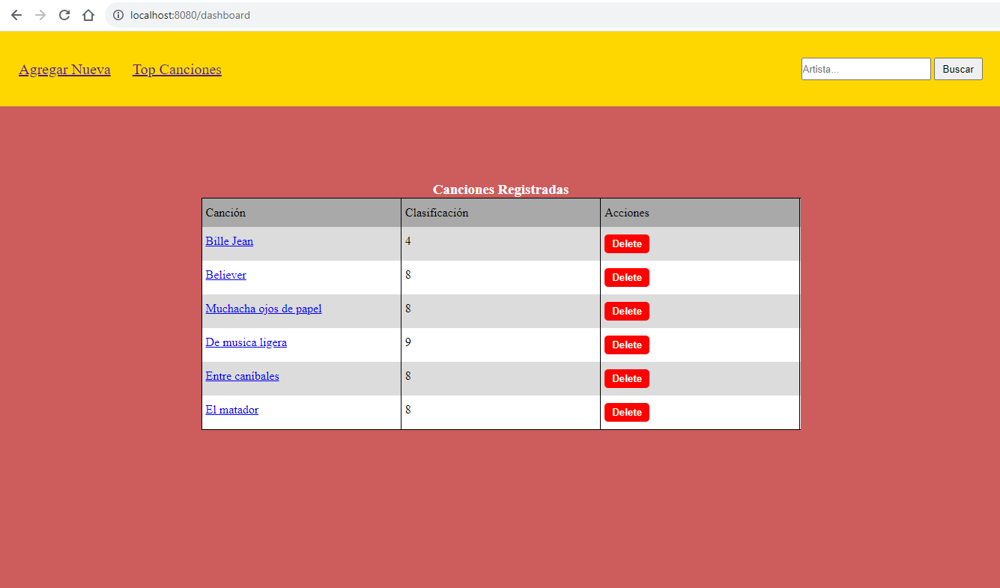
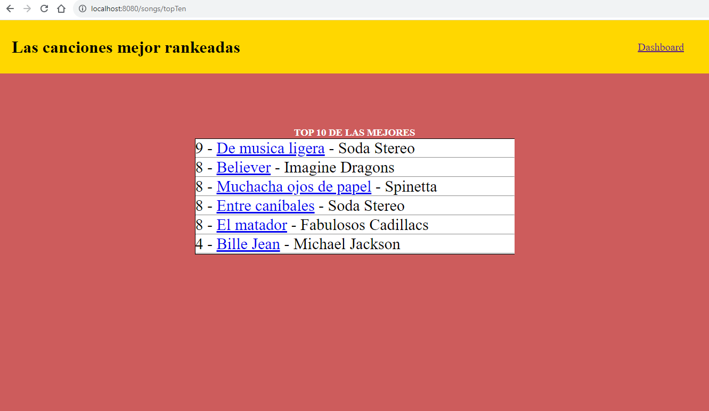
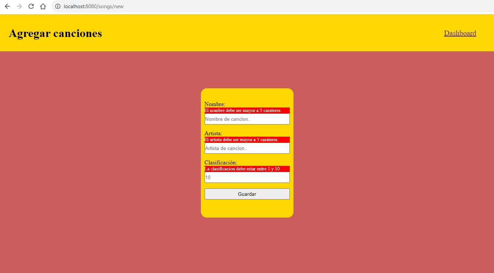
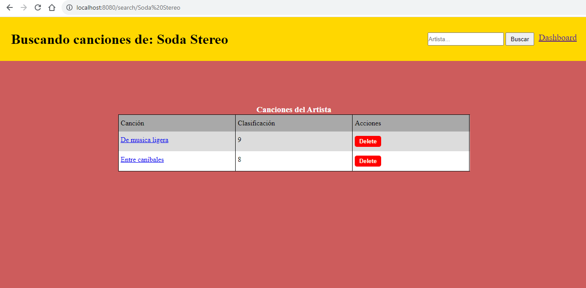

# Lookify - Simulación backend para guardar canciones - Coding Dojo

### Este proyecto fue realizado con Spring Boot para el back y JavaScript vanilla para gestionar las solicitudes HTTP

Se utilizó la librería Thymeleaf para organizar las vistas, es factible realizar un MVC pero para poner
en práctica mis habilidades frontend decidí gestionar las solicitudes con JavaScript.

  
  
  
  

